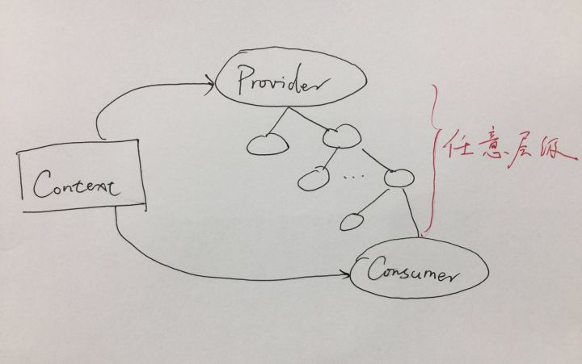

#### 1.调用setState之后发生了什么？
- React会将传入的参数对象与组件当前的状态**合并**，得到新的state对象

- 通过**shouldComponentUpdate**判断是否要进行组件更新
```js
class Test extends React.Component {
    state = {
        name: 'qt'
    }
    changeName = () = >{
        this.setState({
            name: 'fkl'
        });
    }
    shouldComponentUpdate(nextState, nextProps) {
        return false;
    }
    render() {
        alert('render');
        return <div> Hello,{this.state.name}
        <button onClick = {this.changeName}>点击我修改state</button></div>
    }
}
ReactDOM.render( <Test />, document.getElementById('example'));
```

- 如果不需要更新，那么不会执行render方法，否则通过render方法得到**更新后的虚拟DOM**。通过对比虚拟DOM。React会以相对高效的方式根据新的状态构建React元素树并且着手重新渲染整个UI界面。在 React得到元素树之后，React会自动计算出新的树与老树的节点差异，然后根据差异对界面进行最小化重渲染。在差异计算算法中，React能够相对精确地知道哪些位置发生了改变以及应该如何改变，这就保证了按需更新，而不是全部重新渲染。

#### 2.React的DOM diff算法
计算一棵树形结构转换成另一棵树形结构的最少操作，是一个复杂且值得研究的问题。传统diff算法通过循环递归对节点进行依次对比，效率低下，算法复杂度达到 O(n^3)，其中n是树中节点的总数。O(n^3) 到底有多可怕，这意味着如果要展示1000个节点，就要依次执行上十亿次的比较。这种指数型的性能消耗对于前端渲染场景来说代价太高了！现今的CPU每秒钟能执行大约30亿条指令，即便是最高效的实现，也不可能在一秒内计算出差异情况。**Web界面的特点做出了两个简单的假设，使得Diff算法复杂度直接降低到O(n)**:
<pre>
1.Web UI中DOM节点跨层级的移动操作特别少，可以忽略不计。
2.拥有相同类的两个组件将会生成相似的树形结构，拥有不同类的两个组件将会生成不同的树形结构。
3.对于同一层级的一组子节点，它们可以通过唯一id进行区分。
</pre>

深入了解:**Tree Diff, Component Diff, Element Diff**请参考文末资料。


#### 3.React 中 Element 与 Component 的区别是？
简单而言，React Element是描述屏幕上所有所见的内容，**它是对DOM节点的JS对象描述**，它不是屏幕中看到的东西，而是对看到的内容以js对象的形式表述。比如我们可以通过如下方式来创建DOM节点的对象描述:
```js
const element = React.createElement(
  'div',
  {id: 'login-btn'},
  'Login'
)
```
该函数将会返回如下的对象内容:
```js
{
  type: 'div',
  props: {
    children: 'Login',
    id: 'login-btn'
  }
}
```
而当它被渲染到页面中，将会产生如下的DOM节点:
```js
<div id='login-btn'>Login<\/div>
```
典型的React Element 就是利用JSX构建的声明式代码片然后被转化为createElement的调用组合。而React Component则是可以接收参数输入并且返回某个ReactElement的函数或者类。下面是createElement的签名:
```js
React.createElement(
  type,
  [props],
  [...children]
)
```
下面再给出一个jsx=>Element的实例:
```js
function User({ name, addFriend }) {
  return React.createElement(
    "div",
    null,
    React.createElement(
      "p",
      null,
      name
    ),
    React.createElement(Button, { addFriend })
  )
}
```
上面的jsx将会转化为如下的类型:
```js
function User ({ name, addFriend }) {
  return {
    type: 'div',
    props: {
      children: [
        {
          type: 'p',
          props: {
            children: name
          }
        },
        {
          type: Button,
          props: {
            addFriend
          }
        }
      ]
    }
  }
}
```

#### 4.在什么情况下你会优先选择使用 Class Component 而不是 Functional Component？

在组件需要包含**内部状态**或者使用到**生命周期函数**的时候使用 Class Component，否则使用函数式组件。

####  5.React中PureComponent与Component
除了为你提供了一个具有**浅比较的shouldComponentUpdate**方法，PureComponent和Component基本上**完全相同**。当props或者state改变时，PureComponent将对props和state进行浅比较。另一方面，Component不会比较当前和下个状态的props和state。因此，每当shouldComponentUpdate被调用时，组件默认的会重新渲染。下面分析几个例子:
```js
class App extends React.Component {
  state = {
    items: [1, 2, 3],
    loc: {
      name: "覃亮"
    },
    name: "覃亮"
  };
  handleClick = () => {
    const { items,loc } = this.state;
    items.pop();
    delete loc.name;
    this.setState({ items, name: "罄天", loc: this.state.loc });
  };
  shouldComponentUpdate(nextProps, nextState) {
    console.log(
      "SCU:",
      nextState.items === this.state.items,
      nextState.loc == this.state.loc,
      this.state.name == nextState.name
    );
    return true;
  }
  render() {
    return (
      <div>
        <ul>{this.state.items.map(i => <li key={i}>{i}<\/li>)}<\/ul>
        <button onClick={this.handleClick}>delete<\/button>
      <\/div>
    );
  }
}
ReactDOM.render(<App/>, document.getElementById("example"));
```
上面的例子我们有两点要注意:**首先**打印的结果为:true,true,false。因为items,loc都是引用数据类型，所以当你修改数组的值，以及修改对象的属性，其实都是直接对this.state.items,this.state.loc修改，所有nextState和this.state的两个属性都是一致的，因为引用是一致的(你可以手动deepCopy，但是props,nextProps不需要!!!)。**第二点**:我们的shouldComponentUpdate一直返回的true，这和下面的PureComponent有本质的区别。
```js
class App extends React.PureComponent {
  state = {
    items: [1, 2, 3],
    loc: {
      name: "覃亮"
    },
    name: "覃亮"
  };
  handleClick = () => {
    const { items, loc } = this.state;
    items.pop();
    delete loc.name;
    this.setState({ items, loc: this.state.loc });
  };
  render() {
    return (
      <div>
        <ul>{this.state.items.map(i => <li key={i}>{i}<\/li>)}<\/ul>
        <button onClick={this.handleClick}>delete<\/button>
      <\/div>
    );
  }
}
ReactDOM.render(<App />, document.getElementById("example"));
```
区别如下:**第一**:不再需要手动写shouldComponentUpdate(当然你也可以写，那么会覆盖掉默认的shouldComponentUpdate方法);**第二**:不管你怎么点击按钮都不会删除成功，因为通过上面的例子你会看到，this.state.loc===nextState.loc同时this.state.items==nextState.items都是返回true的。那么我们要看到PureComponent的shouldComponentUpdate到底是什么逻辑:
```js
if (this._compositeType === CompositeTypes.PureClass) {
  shouldUpdate = !shallowEqual(prevProps, nextProps) || ! shallowEqual(inst.state, nextState);
}
```
下面是具体的shallowEqual逻辑:
```js
const hasOwn = Object.prototype.hasOwnProperty;
// Object.js的polyfill
// http://imweb.io/topic/598973c2c72aa8db35d2e291
function is(x, y) {
  if (x === y) {
    // -0===0,+0===0,-0===+0
    return x !== 0 || y !== 0 || 1 / x === 1 / y
  } else {
    // 处理 NaN === NaN的情况
    return x !== x && y !== y
  }
}
export default function shallowEqual(objA, objB) {
  if (is(objA, objB)) return true;
  if (typeof objA !== 'object' || objA === null ||
      typeof objB !== 'object' || objB === null) {
    return false
  }
  const keysA = Object.keys(objA)
  const keysB = Object.keys(objB)
  // 比较key长度
  if (keysA.length !== keysB.length) return false
  for (let i = 0; i < keysA.length; i++) {
    // nextState和this.state如果比较引用，如上面的items/loc那么shallowEqual返回true
    // 进而不会更新
    if (!hasOwn.call(objB, keysA[i]) ||
        !is(objA[keysA[i]], objB[keysA[i]])) {
      return false
    }
  }
  return true
}
```
当然，如果你在setState的时候修改了name，下面的例子在**首次点击按钮的时候会删除**，而后面继续点击是不会更新的:
```js
class App extends React.PureComponent {
  state = {
    items: [1, 2, 3],
    loc: {
      name: "覃亮"
    },
    name: "覃亮"
  };
  handleClick = () => {
    const { items, loc } = this.state;
    items.pop();
    delete loc.name;
    // 首次点击name变化了，所以shallowEqual返回false
    // 第二次继续点击的时候,引用不变+name也不变，组件不更新
    // 当然如果是extend React.Component，同时SCU默认返回true的情况下会更新
    this.setState({ items, name: "罄天", loc: this.state.loc });
  };
  render() {
    return (
      <div>
        <ul>{this.state.items.map(i => <li key={i}>{i}<\/li>)}<\/ul>
        <button onClick={this.handleClick}>delete<\/button>
      <\/div>
    );
  }
}
ReactDOM.render(<App />, document.getElementById("example"));
```
这里讲到state和nextState中的引用值是一致的问题，那么如果把这个引用值传递到子级组件中去呢？此时很显然，**this.props/nextProps的引用属性将会是一致的**，比如下面的例子:
```js

class Parent extends React.Component {
  state = {
    name: "qinliang",
    loc: {
      name: "杭州",
      age: 24
    }
  };
  onClick = () => {
    this.setState({});
  };
  render() {
    return (
      <div
        id="parent"
        onClick={this.onClick}
        style={{ border: "1px solid pink" }}
      >
        <Child name={this.state.name} />
      </div>
    );
  }
}
class Child extends React.Component {
  shouldComponentUpdate(nextProps, nextState) {
    console.log("nextProps===", nextProps);
    console.log("this.props===", this.props);
    console.log("this.props===nextProps", this.props.loc === nextProps.loc);
    // 打印true
    return true;
  }
  render() {
    return <div style={{ border: "1px solid yellow" }}>Child</div>;
  }
}
ReactDOM.render(<Parent />, document.getElementById("example"));

```


####  6.不要在render方法里绑定值
假设你有一个项目列表，每个项目都传递一个唯一的参数到父方法。为了绑定参数，你可能会这么做：
```js
<CommentItem likeComment={() => this.likeComment(user.id)} \/>
```
这个问题会导致每次父组件render方法被调用时，**一个新的函数被创建**，以将其传入likeComment。这会有一个**改变每个子组件props的副作用**，它将会造成他们全部重新渲染，即使数据本身没有发生变化。

为了解决这个问题，只需要将父组件的原型方法的引用传递给子组件。子组件的likeComment属性将总是有相同的引用，这样就不会造成不必要的重新渲染。
```js
<CommentItem likeComment={this.likeComment} userID={user.id} \/>
```
然后再子组件中创建一个引用了传入属性的类方法：
```js
class CommentItem extends PureComponent {
  ...
  handleLike() {
    this.props.likeComment(this.props.userID)
  }
  ...
}
```

####  7.不要在render方法里派生数据
考虑一下你的配置组件将从一系列文章中展示用户最喜欢的十篇文章。
```js
render() {
  const { posts } = this.props
  const topTen = posts.sort((a, b) => b.likes - a.likes).slice(0, 9)
  return //...
}
```
每次组件重新渲染时topTen都将有一个新的引用，即使posts没有改变并且派生数据也是相同的。这将造成列表不必要的重新渲染。你可以通过**缓存你的派生数据**来解决这个问题。例如，设置派生数据在你的组件state中，仅当posts更新时它才更新(利用shouldComponentUpdate来完成)。
```js
componentWillMount() {
  this.setTopTenPosts(this.props.posts)
}
componentWillReceiveProps(nextProps) {
  if (this.props.posts !== nextProps.posts) {
    this.setTopTenPosts(nextProps)
  }
}
setTopTenPosts(posts) {
  this.setState({
    topTen: posts.sort((a, b) => b.likes - a.likes).slice(0, 9)
  })
}
```

####  8.React中refs的作用是什么？
Refs是React提供给我们的**安全访问DOM元素或者某个组件实例**的句柄。我们可以为元素添加ref属性然后在回调函数中接受该元素在DOM树中的句柄，该值会作为回调函数的第一个参数返回：
```js
class CustomForm extends Component {
  handleSubmit = () => {
    console.log("Input Value: ", this.input.value)
  }
  render () {
    return (
      <form onSubmit={this.handleSubmit}>
        <input
          type='text'
          ref={(input) => this.input = input} \/>
        <button type='submit'>Submit<\/button>
      <\/form>
    )
  }
}
```
上述代码中的input域包含了一个ref属性，该属性声明的回调函数会接收input对应的DOM 元素，我们将其绑定到this指针以便在其他的类函数中使用。另外值得一提的是，**refs并不是类组件的专属，函数式组件同样能够利用闭包暂存其值**：
```js
function CustomForm ({handleSubmit}) {
  let inputElement
  return (
    <form onSubmit={() => handleSubmit(inputElement.value)}>
      <input
        type='text'
        ref={(input) => inputElement = input} \/>
      <button type='submit'>Submit<\/button>
    <\/form>
  )
}
```

#### React中keys的作用是什么？
Keys是React用于追踪哪些列表中元素被修改、被添加或者被移除的辅助标识。

```js
render () {
  return (
    <ul>
      {this.state.todoItems.map(({task, uid}) => {
        return <li key={uid}>{task}</li>
      })}
    </ul>
  )
}
render () {
  return (
    <ul>
      {this.state.todoItems.map(({task, uid}) => {
        return <li key={uid}>{task}</li>
      })}
    </ul>
  )
}
```
在开发过程中，我们需要保证某个元素的key在其同级元素中具有唯一性。在React Diff算法中React 会借助元素的Key值来判断该元素是新近创建的还是被移动而来的元素，从而减少不必要的元素重渲染。因此我们绝不可忽视转换函数中Key的重要性。

#### 9.如果你创建了类似于下面的Twitter元素，那么它相关的类定义是啥样子的？
```js
<Twitter username='tylermcginnis33'>
  {(user) => user === null
    ? <Loading />
    : <Badge info={user} />}
</Twitter>
<Twitter username='tylermcginnis33'>
  {(user) => user === null
    ? <Loading />
    : <Badge info={user} \/>}
<\/Twitter>
import React, { Component, PropTypes } from 'react'
import fetchUser from 'twitter'
// fetchUser take in a username returns a promise
// which will resolve with that username's data.
class Twitter extends Component {
  // finish this
}
```
如果你还不熟悉**回调渲染模式（Render Callback Pattern）**，这个代码可能看起来有点怪。这种模式中，组件会接收某个函数作为其子组件，然后在渲染函数中以props.children进行调用：
```js
import React, { Component, PropTypes } from 'react'
import fetchUser from 'twitter'
class Twitter extends Component {
  state = {
    user: null,
  }
  static propTypes = {
    username: PropTypes.string.isRequired,
  }
  componentDidMount () {
    fetchUser(this.props.username)
      .then((user) => this.setState({user}))
  }
  render () {
    return this.props.children(this.state.user)
  }
}
```
这种模式的优势在于将**父组件与子组件解耦和**，父组件可以直接访问子组件的内部状态而不需要再通过Props传递，这样父组件能够更为方便地控制子组件展示的UI界面。譬如产品经理让我们将原本展示的Badge替换为Profile，我们可以轻易地修改下回调函数即可：
```js
<Twitter username='tylermcginnis33'>
  {(user) => user === null
    ? <Loading />
    : <Profile info={user} \/>}
<\/Twitter>
```

#### 10.Controlled Component 与 Uncontrolled Component之间的区别是什么？
React的核心组成之一就是能够维持内部状态的自治组件，不过当我们引入**原生的HTML表单元素时**（input,select,textarea 等），我们是否应该将所有的数据托管到React 组件中还是将其仍然保留在DOM 元素中呢？这个问题的答案就是受控组件与非受控组件的定义分割。受控组件（Controlled Component）代指那些交由React控制并且所有的表单数据统一存放的组件。譬如下面这段代码中username变量值并没有存放到DOM元素中，而是存放在组件状态数据中。任何时候我们需要改变username变量值时，我们应当调用setState函数进行修改。
```js
class ControlledForm extends Component {
  state = {
    username: ''
  }
  updateUsername = (e) => {
    this.setState({
      username: e.target.value,
    })
  }
  handleSubmit = () => {}
  render () {
    return (
      <form onSubmit={this.handleSubmit}>
        <input
          type='text'
          value={this.state.username}
          onChange={this.updateUsername} />
        <button type='submit'>Submit</button>
      <\/form>
    )
  }
}
```
而非受控组件（Uncontrolled Component）则是**由DOM存放表单数据**，并非存放在React组件中。我们可以使用refs来操控DOM元素：
```js
class UnControlledForm extends Component {
  handleSubmit = () => {
    console.log("Input Value: ", this.input.value)
  }
  render () {
    return (
      <form onSubmit={this.handleSubmit}>
        <input
          type='text'
          ref={(input) => this.input = input} />
        <button type='submit'>Submit</button>
      <\/form>
    )
  }
}
```
竟然非受控组件看上去更好实现，我们可以直接从DOM中抓取数据，而不需要添加额外的代码。不过实际开发中我们并不提倡使用非受控组件，因为实际情况下我们需要更多的考虑**表单验证、选择性的开启或者关闭按钮点击、强制输入格式等功能支持**，而此时我们将数据托管到 React中有助于我们更好地以声明式的方式完成这些功能。引入React或者其他MVVM框架最初的原因就是为了将我们从繁重的直接操作DOM中解放出来。

#### 11.在生命周期中的哪一步你应该发起AJAX请求？
我们应当将AJAX请求放到componentDidMount函数中执行，主要原因有下：

(1)React下一代调和算法Fiber会通过**开始或停止渲染的方式优化应用性能**，其会影响到componentWillMount的触发次数。对于componentWillMount这个生命周期函数的调用次数会变得不确定，React 可能会多次频繁调用componentWillMount。如果我们将AJAX请求放到 componentWillMount 函数中，那么显而易见其会被触发多次，自然也就不是好的选择。

(2)如果我们将AJAX请求放置在生命周期的其他函数中，我们**并不能保证请求仅在组件挂载完毕后才会要求响应**。如果我们的数据请求在组件挂载之前就完成，并且调用了setState函数将数据添加到组件状态中，对于未挂载的组件则会报错。而在componentDidMount函数中进行AJAX请求则能有效避免这个问题。

#### 12.shouldComponentUpdate的作用是啥以及为何它这么重要？
shouldComponentUpdate允许我们手动地判断是否要进行组件更新，根据组件的应用场景设置函数的合理返回值能够帮我们避免不必要的更新。

#### 13.如何告诉React它应该编译生产环境版本？
通常情况下我们会使用Webpack的DefinePlugin方法来将NODE_ENV变量值设置为production。编译版本中React会忽略propType验证以及其他的告警信息，同时还会降低代码库的大小，React使用了 Uglify 插件来移除生产环境下不必要的注释等信息。

#### 14.为什么我们需要使用React提供的Children API而不是JavaScript的map？
props.children并不一定是数组类型，譬如下面这个元素：
```js
<Parent>
  <h1>Welcome.</h1>
</Parent>
```
如果我们使用props.children.map函数来遍历时会受到异常提示，因为在这种情况下props.children是对象（object）而不是数组（array）。React**当且仅当超过一个子元素的情况下**会将props.children设置为数组，就像下面这个代码片：
```js
<Parent>
  <h1>Welcome.</h1>
  <h2>props.children will now be an array</h2>
<\/Parent>
```
这也就是我们优先选择使用React.Children.map函数的原因，其已经将props.children不同类型的情况考虑在内了。

#### 15.概述下React中的事件处理逻辑
为了解决跨浏览器兼容性问题，React会将浏览器原生事件（Browser Native Event）封装为合成事件（SyntheticEvent）传入设置的事件处理器中。这里的合成事件提供了与原生事件相同的接口，不过它们**屏蔽了底层浏览器的细节差异，保证了行为的一致性**。**另外有意思的是，React并没有直接将事件附着到子元素上，而是以单一事件监听器的方式将所有的事件发送到顶层进行处理**。这样React在更新DOM 的时候就不需要考虑如何去处理附着在DOM上的事件监听器，最终达到优化性能的目的。

#### 16.createElement与cloneElement的区别是什么？
createElement函数是创建新的React元素，而cloneElement则是用于复制某个React元素并传入新的Props。下面是createElement的签名:
```js
React.createElement(
  type,
  [props],
  [...children]
)
```
而下面是cloneElement的签名:
```js
// 注意:第一个参数必须是React Element类型
React.cloneElement(
  element,
  [props],
  [...children]
)
```
用法如下:
```js
const {children} = this.props,
newChildren = React.Children.map(children, child =>
React.cloneElement(
        child,
        { onChange: e => alert(e.target.value) }
));
```
克隆的**元素(如果是class必须通过createElement处理)**会有原有元素的props，同时老的props将会和新的props合并(shallowly)，新的children将会替代老的children，同时被克隆的元素的key,ref也会被保存下来。cloneElement与下面的类似:
```js
<element.type {...element.props} {...props}>{children}<\/element.type>
```
比如下面的例子:
```js
class GrandParent extends React.Component {
  componentDidMount() {
    console.log("this.refs", this.refs);
  }
  render() {
    const createdElement = React.createElement(Child, {
      ref: "child",
      key: 100
    });
    //cloneElement必须克隆的是react element，不能是一个class,下面是错误的
    //const ClonedElement =  React.createElement(Child,{style:{border:'1px solid yellow'}});
    const ClonedElement = React.cloneElement(createdElement);
    return (
      <div style={{ border: "1px solid red" }}>
        <Parent ref="parent">{ClonedElement}</Parent>
      </div>
    );
  }
}
class Parent extends React.Component {
  getComponentName() {
    return "Parent";
  }
  render() {
    return (
      <div style={{ border: "1px solid pink" }}>{this.props.children}<\/div>
    );
  }
}
class Child extends React.Component {
  getComponentName() {
    return "Child";
  }
  render() {
    return (
      <div style={{ border: "1px solid blue" }}>{this.props.children}<\/div>
    );
  }
}
ReactDOM.render(<GrandParent \/>, document.getElementById("example"));
```
从上面的例子可以看到，我们通过createElement创建的React元素，然后通过cloneElement进行克隆，最后ref能够正常访问到child元素。同时官方网站给出了如下晦涩难懂的描述:
<pre>
However, it also preserves refs. This means that if you get a child with a ref on it, you won’t accidentally steal it from your ancestor. You will get the same ref attached to your new element.
</pre>

具体解释可以[参考这里](https://stackoverflow.com/questions/42578982/is-this-a-bug-in-react-cloneelement)。

#### 17.传入setState函数的第二个参数的作用是什么？
该函数会在setState函数调用完成并且组件开始重渲染的时候被调用，我们可以用该函数来监听渲染是否完成：
```js
this.setState(
  { username: 'tylermcginnis33' },
  () => console.log('setState has finished and the component has re-rendered.')
)
```
下述代码有错吗？
```js
this.setState((prevState, props) => {
  return {
    streak: prevState.streak + props.count
  }
})
```

#### 18.ES5的React和ES6的React区别，ES6的React有什么优势和劣势?
##### 18.1 语法
```js
// ES5
React.createClass()
// ES6
class SomeModule extends React.Component{}
```
###### 18.2 自动绑定this
ES5会自动绑定this，而ES6需要手动绑定。

#### 19.单向数据流是如何工作的
在React中,数据是从父级往子级流动的，而不能反向流动。属性是一系列的不可变值，以html标签的形式传输到组件的render方法。组件无法直接修改任何传递给它的属性，但是可以通过传递给它的回调函数将数据通知给上层组件。这就是所谓的:"属性往下流动，行为向上移动"。

#### 20.什么是React，它和其他框架的主要区别是什么?
React是一个javascript库，是Facebook开发用于创建用户界面的，它被认为是MVC中的View部分，React可以计算出最少的改变进而使得也能能够得到更新。

#### 21.forceUpdate和setState的区别?两者都会更新state?
setState是当state或者props改变的时候去更新应用，但是如果你的应用依赖于其他的数据，你可以使用forceUpdate方法。forceUpdate方法会使得当前组件的render方法被执行，同时**跳过shouldComponentUpdate方法**。但是该方法依然会**触发子级组件的生命周期方法**，包括子级组件的shouldComponentUpdate方法。

#### 22.AJAX/Network请求一般都在那个生命周期方法中?
（1）使用**componentDidUpdate**或者**componentDidMount**方法。如果你使用**componentWillMount**，那么ajax请求可能在组件挂载之前就完成了，此时你可能调用一个未挂载的组件的setState方法，这可能会引入隐藏的bugs。

（2）componentWillMount因为性能原因在一次render中可能会被调和算法多次调用，这可能会导致多余的ajax请求。

#### 23.受控组件需要使用ref的场景?
管理焦点,selection选中，必要的动画，继承第三方的DOM库。

#### 24.什么是HOC，在React中如何使用？
HOC是一个函数，这个函数接受一个组件，然后返回一个新的组件。Component的本质是将属性props转化为UI，而高阶组件的本质是将一个组件转化为一个新的组件。

HOC不会修改输入的组件，也不会继承它的行为。HOC通过将它包裹在一个容器组件中而组合原始的组件，HOC是一个**纯函数不具有任何副作用**。

#### 25.extend, mixins和HOC区别以及各自的优劣势?
##### 25.1 Mixins方式(ES6模式的extend React.Component不能使用)
```js
// 零件仓库1
function Moveable() {}
Moveable.prototype.walk = function() {
    console.log('walked slowly');
}
Moveable.prototype.run = function() {
    console.log('ran quickly');
}
Moveable.prototype.jump = function() {
    // ...
}
// 零件仓库2
function Souled() {}
Souled.prototype.smile = function(age) {
    console.log('smiled as ' + age + ' year\'s old kid');
}
// 零件仓库3
// mixin
function augment(sub, sup) {
    // 继承所有属性
    if (arguments.length === 2) {
        for(var attr in sup.prototype) {
            sub.prototype[attr] = sup.prototype[attr];
        }
    }
    // 继承部分属性
    else if(arguments.length > 2) {
        for (var i = 2; i < arguments.length; i++) {
            sub.prototype[arguments[i]] = sup.prototype[arguments[i]];
        }
    }
    else {
        // do nothing
    }
}
// 需要增强的类
function Robot(name) {
    this.name = name;
}
// 增强
augment(Robot, Moveable, 'walk', 'run');
// 从Moveable继承walk和run
augment(Robot, Souled);                     
// 继承Souled的全部属性
var robot = new Robot('little boy');
robot.walk();       // walked slowly
robot.run();        // ran quickly
robot.smile(12);    // smiled as 12 year's old kid
```
Mixin是一种很灵活的代码复用方式，但**把功能注入原型对象会导致原型污染和函数来源方面的不确定性，在大型系统中可能是一个严重的问题**。可以通过详细的文档来解决函数来源不确定的问题，但原型污染是不可避免的。

##### 25.2 Extends方式
Mixin虽然可行，但是不是React ES6 API的内置方法。而ES6 API可以通过一种简单的方式创建一个自定义组件并继承于另一个组件。ES6的类允许我们继承另一个类的功能，**但是如果需要创建一个类并从多个mixin或者类来继承属性，我们是需要原型链的**。

#### 26.props.children和React.Children的区别?
props.children在只有一个子级元素的时候是一个对象，否则是一个数组(没有子级元素是undefined)。下面的组件结构就是对象:
```js
<Parent>
    <Child />
<\/Parent>
```
而下面就是一个数组:
```js
<Parent>
    <Child />
    <Cousin />
<\/Parent>
```

#### 27.React中属性的默认值?
在ES6中使用:
```js
SomeModule.defaultProps = {name: 'Ben', age: 36}
```
无状态组件中使用:
```js
export const SomeModule = ({name="Ben", age=36}) => {
    return (
        <div>{name}, {age}<\/div>
    )
}
```

#### 28.父组件如何调用子组件的方法?
```js
class Parent extends React.Component {
  render() {
    return (
      <div>
        <Child onRef={this.onRef} \/>
        <button onClick={this.click}>click<\/button>
      <\/div>
    );
  }
  onRef = ref => {
    this.child = ref;
  };
  click = e => {
    this.child.myName();
  };
}
class Child extends React.Component {
  componentDidMount() {
    this.props.onRef(this);
  }
  myName = () => alert("罄天");
  render() {
    return <div>'woqu'<\/div>;
  }
}
ReactDOM.render(<Parent \/>, document.getElementById("example"));
```

#### 29.那些生命周期方法不能调用setState?
<pre>
componentWillUnmount
componentWillUpdate
render
</pre>

#### 30.直接修改state与调用setState的区别?
```js

class Parent extends React.Component {
  state = {
    name: "qinliang",
    age: 24,
    loc: {
      name: "杭州",
      age: 24
    }
  };
  onClick = () => {
    this.state.name = "罄天";
    // this.setState({
    //   age: 25
    // });
    // 如果这里不调用setState，那么state虽然更新了，但是并不会走生命周期方法render
  };
  render() {
    console.log("this.state.name===", this.state.name);
    return (
      <div
        id="parent"
        onClick={this.onClick}
        style={{ border: "1px solid pink" }}
      >
        <Child name={this.state.name} />
        {this.state.name} | {this.state.age}
      </div>
    );
  }
}
class Child extends React.Component {
  shouldComponentUpdate(nextProps, nextState) {
    return true;
  }
  render() {
    return <div style={{ border: "1px solid yellow" }}>Child</div>;
  }
}
ReactDOM.render(<Parent />, document.getElementById("example"));
```
不调用setState，那么state虽然更新了，但是并**不会走生命周期方法**。

#### 31.React中setState()[为什么是异步的](https://github.com/facebook/react/issues/11527#issuecomment-360199710)？
假如有一个例子，父级和子级都监听click事件，Child/Parent都调用setState，但是我们不想要渲染Child组件两次，相反，我们更倾向于将它们设置为脏组件，然后一起渲染他们。

你可能会问:为什么我们**不批量处理**而是要在一致性对比还[没有完成之前再次调用setState](https://github.com/facebook/react/issues/11527#issuecomment-360199710)?

##### 31.1 保证内部一致性
即使state同步更新，但是props却不是，因为在**没有重新渲染父级组件**的情况下是不知道组件的props,但是如果你每次都重新渲染父级组件，那么批量处理无从谈起。React提供的state,props,refs在内部都是一致的，这也就表示如果你仅仅使用这些对象，那么它们都是指向一致化的组件树，即使是更新之前的组件树。

如果你仅仅使用state,而且是同步刷新，此时将会是如下的写法:
```js
console.log(this.state.value) // 0
this.setState({ value: this.state.value + 1 });
console.log(this.state.value) // 1
this.setState({ value: this.state.value + 1 });
console.log(this.state.value) // 2
```
但是，如果你需要将state抽取到父组件中进而在多个组件中进行共享，此时将会是如下的代码:
```js
-this.setState({ value: this.state.value + 1 });
+this.props.onIncrement(); 
// 在父组件中仅仅是setState
```
但是，此时你的代码将会像下面一样:
```js
console.log(this.props.value) // 0
this.props.onIncrement();
console.log(this.props.value) // 0
this.props.onIncrement();
console.log(this.props.value) // 0
```
这是因为，在上面你提到的模型中，我们及时刷新了this.state,但是this.props却无法及时刷新。因为我们在没有重新渲染父组件的情况下是无法及时刷新this.props的，这也意味着我们需要放弃批量处理逻辑(这在某些情况下将会极大的影响性能)。

##### 31.2 性能优化
我们通常认为状态更新会按照**既定顺序被应用**，无论state是同步更新还是异步更新。然而事实并不一定如此。React会依据不同的调用源，给不同的 setState()调用分配不同的**优先级。调用源包括事件处理、网络请求、动画**等。

假设你在一个聊天窗口，你正在输入消息，TextBox组件中的setState()调用需要被立即应用。然而，在你输入过程中又收到了一条新消息。更好的处理方式或许是延迟渲染新的 MessageBubble组件，从而让你的输入更加顺畅，而不是立即渲染新的MessageBubble **组件阻塞线程，导致你输入抖动和延迟**。如果给某些更新分配低优先级，那么就可以把它们的渲染分拆为几个毫秒的块，用户也不会注意到。

##### 31.3 更多的可能性
异步更新并不只关于性能优化，而是React组件模型能做什么的一个根本性转变（fundamental shift）。假设你从一个页面导航到到另一个页面，通常你需要展示一个**加载动画，等待新页面的渲染**。但是如果导航非常快，闪烁一下加载动画又会降低用户体验。

如果这样会不会好点，你只需要简单的调用 setState()去渲染一个新的页面，React “在幕后”开始渲染这个新的页面。想象一下，不需要你写任何的协调代码，如果这个更新花了比较长的时间，你可以展示一个加载动画，否则在新页面准备好后，让React执行一个无缝的切换。**此外，在等待过程中，旧的页面依然可以交互，但是如果花费的时间比较长，你必须展示一个加载动画**。

需要注意的是，**异步更新state是有可能实现这种设想的前提**。如果同步更新state就没有办法在幕后渲染新的页面，还保持旧的页面可以交互。它们之间独立的状态更新会冲突。你也可以阅读这个文章[setState为什么不会同步更新组件状态](https://zhuanlan.zhihu.com/p/25990883)。

#### 32.React组件设计原则
##### 32.1 单一职责(Single responsibility principle)
React组件设计推崇的是**“组合”，而非“继承”**。例如你的页面需要一个表单组件，表单中需要有输入框，按钮，列表，单选框等。那么在开发中你不应该只开发一（整）个表单组件（<Form>），而是应该开发若干个单一功能的组件，比如输入框<Input>、提交按钮<Submit>、单选框<Checkbox>等，最后再将它们组合起来。这其中的重点是每个组件仅做一件事。这样**容器组件(container components),展示组件(Presentational Components)的分离逻辑**才能更好的表现。

##### 32.2 开放/封闭(Open/closed principle)原则
开放/封闭强调的是对修改封闭（禁止修改内部代码），对拓展开放（允许你拓展功能）。因为修改意味着风险，可能会影响到不用修改的代码， 同时意味着暴露细节。你一定纳闷如果不允许修改代码的话如何拓展功能呢，在传统的面向对象编程中，这样的需求是通过继承和接口机制来实现的。在React中我们使用官方推荐的**Higher-Order Components**的模式去实现。这个在后面会详细叙述。

#### 33.如何对组件[进行优化](http://qingbob.com/understand-react-02/)
##### 33.1 使用上线构建（Production Build）
会移除脚本中不必要的警告和报错，减少文件体积。

##### 33.2 避免重绘 （Avoid Reconciliation）
重写shouldComponentUpdate函数，手动控制是否应该调用render函数进行重绘

##### 33.3 尽可能的使用 Immutable Data（ The Power Of Not Mutating Data）
尽可能的不修改数据，而是重新赋值数据。这样的话，在检测数据对象是否发生修改方面会非常快，只需要检测对象引用即可，而不用挨个的检测对象属性的更改。最后一条建议摘自官方描述的关于Virtual DOM的工作原理Reconciliation

##### 33.4 在渲染组件的时候尽可能的添加key 
这样Virtual DOM在对比时就会更容易发现哪里是修改元素，哪里是新插入的元素。这里也同时回答了key的作用。如果你有使用过React渲染一个列表的话，它会建议你给每一项添加上key。我个人认为key就类似于DOM中的id，不过是组件级别的，用于标记元素的唯一性。

#### 34.state中数据
##### 34.1 State里应该包含什么
组件的事件处理函数可能进行修改的，导致UI更新的数据（State should contain data that a component’s event handlers may change to trigger a UI update. ）

##### 34.2 State里不应该有什么
计算得出的数据;React组件;从props[复制来的数据](https://shripadk.github.io/react/docs/interactivity-and-dynamic-uis.html)。

#### 35.React 16.x新特性
##### 35.1 新Context的API
```js
import {createReactContext} from 'react';
```
被导入的createReactContext，从名字的形式就知道是一个函数，用于创造一个Context对象，然后这个Context对象又包含两个属性，一个叫Provider，另一个叫Consumer，这两个属性都是纯种的React组件。



在组件树中，`Provider负责提供context，而Consumer用来消费Provider提供的context`，而且，它们之间可以隔着任意层级，依然保留心有灵犀，这就是Context的意义。下面展示了使用context**切换主题的示例**:

```js
class ThemeProvider extends React.Component {
  state = {
    theme: defaultTheme
  }
  render() {
    return (
      <ThemeContext.Provider value={this.state.theme}>
        <Content/>
        <div>
          <button onClick={() => {
            this.setState(state => ({
              theme: state.theme === defaultTheme ? fooTheme : defaultTheme
            }))
          }}>
            Toggle Theme
          <\/button>
        <\/div>
      <\/ThemeContext.Provider>
    );
  }
}
```
当Toggle Theme按钮被点击的时候，ThemeProvider的state被改变，state的改变引起ThemeProvider的重新渲染，重新渲染引起render函数被调用，从而引起ThemeContext.Provider的重新渲染，传递给value属性的是最新的state，这样，就把新的context值应用上了。点击Toggle Theme按钮，Banner的色调会来回切换。

新的Context API获得广泛赞誉无外乎两个原因:

<pre>
1.应用了Render Props模式
2.React宣称迁移到新的Context API之后，就会摘掉“试验性”的帽子
</pre>

本部分内容参考[React 16.3新的Context API真的那么好吗？](https://zhuanlan.zhihu.com/p/34382261)


##### 35.2 Portal
Portal就是建立一个“传送门”，让Dialog这样的组件在**表示层和其他组件没有任何差异，但是渲染的东西却像经过传送门一样出现在另一个地方**。

React在v16之前的传送门实现方法在v16之前，实现“传送门”，要用到两个秘而不宣的React API:

<pre>
unstable_renderSubtreeIntoContainer
unmountComponentAtNode
</pre>

第一个unstable_renderSubtreeIntoContainer，都带上前缀unstable了，就知道并不鼓励使用，但是没办法啊，不用也得用，还好React一直没有deprecate这个API，一直挺到v16直接支持portal。这个API的作用就是建立“传送门”，可以把JSX代表的组件结构塞到传送门里面去，让他们在传送门的另一端渲染出来。

第二个unmountComponentAtNode用来清理第一个API的副作用，通常在unmount的时候调用，不调用的话会造成资源泄露的。

一个通用的Dialog组件的实现差不多是这样，注意看renderPortal中的注释。
```js
import React from 'react';
import {unstable_renderSubtreeIntoContainer, unmountComponentAtNode} 
  from 'react-dom';
class Dialog extends React.Component {
  render() {
    return null;
  }
  componentDidMount() {
    const doc = window.document;
    this.node = doc.createElement('div');
    doc.body.appendChild(this.node);
    this.renderPortal(this.props);
  }
  componentDidUpdate() {
    this.renderPortal(this.props);
  }
  componentWillUnmount() {
    unmountComponentAtNode(this.node);
    // 清理portal
    window.document.body.removeChild(this.node);
  }
  renderPortal(props) {
    unstable_renderSubtreeIntoContainer(
      this, //代表当前组件
      <div class="dialog">
        {props.children}
      <\/div>, // 塞进传送门的JSX
      this.node // 传送门另一端的DOM node
    );
  }
}
```
(1)首先，render函数不要返回有意义的JSX，也就说这个组件通过正常生命周期什么都不画，要是画了，那画出来的HTML/DOM就直接出现在使用Dialog的位置了，这不是我们想要的。

(2)在componentDidMount里面，利用原生API来在body上创建一个div，这个div的样式绝对不会被其他元素的样式干扰。

(3)然后，无论componentDidMount还是componentDidUpdate，都调用一个renderPortal来往“传送门”里塞东西。

React在v16中，使用Portal创建Dialog组件简单多了，不需要牵扯到**componentDidMount、componentDidUpdate，也不用调用API清理Portal**，关键代码在render中，像下面这样就行。
```js
import React from 'react';
import {createPortal} from 'react-dom';
class Dialog extends React.Component {
  constructor() {
    super(...arguments);
    const doc = window.document;
    this.node = doc.createElement('div');
    doc.body.appendChild(this.node);
  }
  render() {
    return createPortal(
      <div class="dialog">
        {this.props.children}
      <\/div>, //塞进传送门的JSX
      this.node //传送门的另一端DOM node
    );
  }
  componentWillUnmount() {
    window.document.body.removeChild(this.node);
  }
}
```
在v16中，通过Portal渲染出去的DOM，事件是会冒泡从传送门的入口端冒出来的，上面的onDialogClick也就会被调用到了,但是V16以前却是不可以的!
```js
<div onClick={onDialogClick}>   
   <Dialog>
     What ever shit
   <\/Dialog>
<\/div>
```
本部分内容来自[传送门：React Portal](https://zhuanlan.zhihu.com/p/29880992?utm_source=wechat_session&utm_medium=social&from=singlemessage)。

##### 35.3 React 16 中的异常处理
```js
class ErrorBoundary extends React.Component {
  constructor(props) {
    super(props);
    this.state = { hasError: false };
  }
  componentDidCatch(error, info) {
    // Display fallback UI
    this.setState({ hasError: true });
    // You can also log the error to an error reporting service
    logErrorToMyService(error, info);
  }
  render() {
    if (this.state.hasError) {
      // You can render any custom fallback UI
      return <h1>Something went wrong.<\/h1>;
    } else {
      return this.props.children;
    }
  }
}
```
然后我们就可以如常使用该组件(以前componentDidCatch使用的是unstable_handleError)：
```js
<ErrorBoundary>
<MyWidget />
<\/ErrorBoundary>
```
在React 15.x及之前的版本中，组件内的异常有可能会影响到React的内部状态，进而导致下一轮渲染时出现未知错误。这些组件内的异常往往也是由应用代码本身抛出，在之前版本的 React更多的是交托给了开发者处理，而没有提供较好地**组件内优雅处理这些异常的方式**。在 React 16.x 版本中，引入了所谓 Error Boundary 的概念，从而保证了发生在 `UI层的错误不会连锁导致整个应用程序崩溃`；未被任何异常边界捕获的异常可能会导致整个React组件树被卸载。所谓的**异常边界即指某个能够捕获它的子元素（包括嵌套子元素等）抛出的异常**，并且根据用户配置进行优雅降级地显示而不是导致整个组件树崩溃。异常边界能够捕获渲染函数、生命周期回调以及整个组件树的构造函数中抛出的异常。我们可以通过为某个组件添加新的 componentDidCatch(error, info)生命周期回调来使其变为异常边界。内容来自[React 16 中的异常处理](https://zhuanlan.zhihu.com/p/28156587)。

##### 35.4 render可返回数组和字符串
不用在外层包裹一个无用的div元素了。

##### 35.5 更好的服务端渲染
与之前renderToString方法不同，新版本提供的**renderToNodeStream** 将返回Readable，可以持续产生字节流（a stream of bytes）并在下一部分的document 生成之前将之前已生成的部分document传回给客户端。通常来讲，新的服务端渲染将比老的快3倍以上。在 document到达客户端之后，新版本的react也将不会再去将客户端的初次渲染结果与服务端的渲染结果进行比较，而是尽可能地去重用相同的DOM元素。

##### 35.6 支持自定义DOM
新版本将不会再抛出不支持的DOM元素属性的警告或者错误，而是将所有开发者自定义的DOM元素都传递到相应的DOM节点上。比如下面的DOM:
```js
// Your code:
<div mycustomattribute="something" />
```
在React15时候将会如下:
```js
// React 15 output:
<div />
```
而在React16时候将会得到如下内容:
```js
// React 16 output:
<div mycustomattribute="something" />
```

##### 35.7 更小的打包大小
(1)react is 5.3 kb (2.2 kb gzipped), 老版本 20.7 kb (6.9 kb gzipped)

(2)react-dom is 103.7 kb (32.6 kb gzipped), 老版本 141 kb (42.9 kb gzipped)

(3)react + react-dom is 109 kb (34.8 kb gzipped), 老版本 161.7 kb (49.8 kb gzipped)

#### 36.React Fiber
**React Fiber是对核心算法的一次重新实现**。

一部分内容参考[如何评价React v16.0?](https://www.zhihu.com/question/65920482/answer/236159084)。


##### 36.1 同步更新过程的局限
在现有React中，**更新过程是同步的**，这可能会导致性能问题。当React决定要`加载或者更新`组件树时，会做很多事，比如调用各个组件的生命周期函数，计算和比对Virtual DOM，最后更新DOM树，这整个过程是**同步**进行的，也就是说只要一个加载或者更新过程开始，那React就以不破楼兰终不还的气概，一鼓作气运行到底，中途绝不停歇。

表面上看，这样的设计也是挺合理的，**因为更新过程不会有任何I/O操作**嘛，完全是CPU计算，所以无需异步操作，的确只要一路狂奔就行了，但是，当组件树比较庞大的时候，问题就来了。

假如更新一个组件需要1毫秒，如果有200个组件要更新，那就需要200毫秒，在这200毫秒的更新过程中，浏览器那个唯一的主线程都在专心运行更新操作，无暇去做任何其他的事情。想象一下，在这200毫秒内，用户往一个input元素中输入点什么，敲击键盘也不会获得响应，因为渲染输入按键结果也是浏览器主线程的工作，但是浏览器主线程被React占着呢，抽不出空，最后的结果就是用户敲了按键看不到反应，等React更新过程结束之后，咔咔咔那些按键一下子出现在input元素里了。就是所谓的界面卡顿，很不好的用户体验。

现有的React版本，当组件树很大的时候就会出现这种问题，因为更新过程是**同步地一层组件套一层组件**，逐渐深入的过程，在更新完所有组件之前不停止，函数的调用栈就像下图这样，调用得很深，而且很长时间不会返回。


因为JavaScript单线程的特点，每个同步任务不能耗时太长，不然就会让程序不会对其他输入作出相应，React的更新过程就是犯了这个禁忌，而React Fiber就是要改变现状。

##### 36.2 React Fiber的方式
破解JavaScript中同步操作时间过长的方法其实很简单——**分片**。把一个耗时长的任务分成很多小片，每一个小片的运行时间很短，虽然总时间依然很长，但是在每个小片执行完之后，都给其他任务一个执行的机会，这样唯一的线程就不会被独占，其他任务依然有运行的机会。

**React Fiber把更新过程碎片化**，执行过程如下面的图所示，每执行完一段更新过程，就把**控制权交还给React负责任务协调的模块**，看看有没有其他紧急任务要做，如果没有就继续去更新，如果有紧急任务，那就去做紧急任务。**维护每一个分片的数据结构，就是Fiber**。有了分片之后，更新过程的调用栈如下图所示，中间每一个波谷代表深入某个分片的执行过程，每个波峰就是一个分片执行结束交还控制权的时机。


##### 36.3 为什么叫Fiber呢？
大家应该都清楚进程（Process）和线程（Thread）的概念，在计算机科学中还有一个概念叫做Fiber，英文含义就是“纤维”，意指比Thread更细的线，也就是**比线程(Thread)控制得更精密的并发处理机制**。

上面说的Fiber和React Fiber不是相同的概念，但是，我相信，React团队把这个功能命名为Fiber，含义也是更加紧密的处理机制，比Thread更细。

##### 36.4 React Fiber对现有代码的影响
理想情况下，React Fiber应该完全不影响现有代码，但可惜并完全是这样？在React Fiber中，一次更新过程会分成多个分片完成，所以**完全有可能一个更新任务还没有完成，就被另一个更高优先级的更新过程打断，这时候，优先级高的更新任务会优先处理完，而低优先级更新任务所做的工作则会完全作废，然后等待机会重头再来**。

因为一个更新过程可能被打断，所以React Fiber一个更新过程被分为两个阶段(Phase):**第一个阶段Reconciliation Phase和第二阶段Commit Phase**。

在第一阶段Reconciliation Phase，React Fiber会找出需要更新哪些DOM，这个阶段是可以被打断的；但是到了第二阶段Commit Phase，那就一鼓作气把DOM更新完，绝不会被打断。这两个阶段大部分工作都是React Fiber做，和我们相关的也就是生命周期函数。以`Render函数为界`，第一阶段可能会调用下面这些生命周期函数，说是“可能会调用”是因为不同生命周期调用的函数不同。

<pre>
componentWillMount
componentWillReceiveProps
shouldComponentUpdate
componentWillUpdate
</pre>

下面这些生命周期函数则会在第二阶段调用。

<pre>
componentDidMount
componentDidUpdate
componentWillUnmount
</pre>

因为第一阶段的过程会被打断而且“重头再来”，就会造成意想不到的情况。比如说，一个低优先级的任务A正在执行，已经调用了某个组件的componentWillUpdate函数，接下来发现自己的时间分片已经用完了，于是冒出水面，看看有没有紧急任务，哎呀，真的有一个紧急任务B，接下来React Fiber就会去执行这个紧急任务B，任务A虽然进行了一半，但是没办法，只能完全放弃，等到任务B全搞定之后，任务A重头来一遍，注意，是重头来一遍，不是从刚才中段的部分开始，也就是说，componentWillUpdate函数会被再调用一次。在现有的React中，每个生命周期函数在一个加载或者更新过程中绝对只会被调用一次；**在React Fiber中，不再是这样了，第一阶段中的生命周期函数在一次加载和更新过程中可能会被多次调用**！


使用React Fiber之后，一定要检查一下第一阶段相关的这些生命周期函数，看看`有没有逻辑是假设在一个更新过程中只调用一次，有的话就要改了`。我们挨个看一看这些可能被重复调用的函数。

(1)componentWillReceiveProps，即使当前组件不更新，只要父组件更新也会引发这个函数被调用，所以多调用几次没啥，通过！

(2)shouldComponentUpdate，这函数的作用就是返回一个true或者false，不应该有任何副作用，多调用几次也无妨，通过！

(3)Render，应该是纯函数，多调用几次无妨，通过！

**只剩下componentWillMount和componentWillUpdate这两个函数往往包含副作用，所以当使用React Fiber的时候一定要重点看这两个函数的实现**。本部分内容详见[React Fiber是什么](https://zhuanlan.zhihu.com/p/26027085)
#### 37.手写简单的redux
#### 38.React与Vue的比较
##### 38.1 React和Vue有许多相似之处
它们都是JavaScript的UI框架;使用 Virtual DOM;将注意力集中保持在核心库，而将其他功能如**路由和全局状态管理**交给相关的库。

##### 38.2 追踪变化/更新DOM/视图渲染/Vue和React的设计思想有什么区别

简述：vue是采用**双向绑定**去做数据更新，视图渲染。而react是**单向的**，通过对比状态差异更新。

###### 38.2.1 Vue
(1)对数据进行劫持监听,当你把一个普通的JavaScript对象传给Vue实例的data选项，Vue 将遍历此对象所有的属性，并使用 Object.defineProperty把这些属性全部转为getter/setter。

(2)实现一个监听器Observer，用来**劫持并监听**所有属性，如果有变动的，就通知订阅者(Watcher)

(3)实现一个订阅者Watcher，为连接Observer和Compile的桥梁，能够订阅并收到每个属性变动的通知，执行指令绑定的相应回调函数，从而更新视图。

(4)实现一个解析器Compile，对每个元素节点的指令进行扫描和解析，根据指令模板替换数据，以及绑定相应的更新函数


示例代码如下:
```js
const Dep = {
  target: null
}
function defineReactive (obj, key, val) {
  const deps = [];
  // 至于为什么这里的deps是一个数组而不是一个变量，是因为可能同一个属性会被多个计算属性所依
  // 也就是存在多个Dep.target。定义deps为数组，若当前属性的setter被触发，就可以批量调用
  // 多个计算属性的onComputedUpdate()方法了
  Object.defineProperty(obj, key, {
    get () {
      console.log(`我的${key}属性被读取了！`);
      // 回调函数中读取了hero.health，所以这里被push进去了
      if (Dep.target && deps.indexOf(Dep.target) === -1) {
        deps.push(Dep.target)
      }
      return val
    },
    set (newVal) {
      console.log(`我的${key}属性被修改了！`);
      val = newVal;
      deps.forEach((dep) => {
        dep()
      })
    }
  })
}
function observable (obj) {
  const keys = Object.keys(obj)
  for (let i = 0; i < keys.length; i++) {
    defineReactive(obj, keys[i], obj[keys[i]])
  }
  return obj
}
// 将最新的监听值emit出去
function onComputedUpdate (val) {
  console.log(`我的类型是：${val}`)
}
//监听type属性，该属性依赖于health
function watcher (obj, key, cb) {
  const onDepUpdated = () => {
    const val = cb();
    // 最新的值通知出去
    onComputedUpdate(val)
  }
  Object.defineProperty(obj, key, {
    get () {
      Dep.target = onDepUpdated;
      const val = cb();
      // 1.每次读取计算属性type都会先读取一次health属性(因为observable有监听)
      // 2.读取health属性的时候会把watch函数作为回调传入
      Dep.target = null;
      // 3.每次读取获取到最新的watch值之后，需要重置Dep.target值
      // 4.每一个watcher监听函数只会被添加一次，而不会被重复添加!！因为这里是闭包引用onDepUpdated!!
      return val;
    },
    set () {
      console.error('计算属性无法被赋值！')
    }
  });
}
const hero = observable({
  health: 3000,
  IQ: 150
});
// hero的[计算属性]type依赖于原有的属性health
watcher(hero, 'type', () => {
  return hero.health > 4000 ? '坦克' : '脆皮'
});
console.log(`英雄初始类型：${hero.type}`);
hero.health = 5000;
// -> 我的health属性被读取了！
// -> 英雄初始类型：脆皮
// -> 我的health属性被修改了！
// -> 我的health属性被读取了！
// -> 我的类型是：坦克
```

###### 38.2.2 React
(1)在代码中调用setState函数之后，React会将传入的参数对象与组件当前的状态合并，然后触发所谓的调和过程。调和过程后有一个新的UI树，这个UI树需要跟旧的UI树做对比。

(2)采用Diff算法，不同节点类型的比较。分两种情况：节点类型不同：直接删除旧的节点，再新建新的节点;节点类型相同，属性不同，对比属性，只改变变化了的节点属性

(3)构建React元素树并且着手重新渲染整个UI界面
 
(4)shouldComponentUpdate -> componentWillUpdate -> render -> componentDidUpdate

(5)在React得到元素树之后，React会自动计算出新的树与老树的节点差异，然后根据差异对界面进行最小化重渲染。

(6)在差异计算算法中，React能够相对精确地知道哪些位置发生了改变以及应该如何改变，这就保证了按需更新，而不是全部重新渲染。


##### 38.3 数据流
###### 38.3.1 Vue
(1)父子组件之间的数据通信是通过**props和自定义事件**实现的

(2)使用events向父组件发送消息：

(3)向父组件发送事件，我们可以调用实例中内置的$emit方法

(4)通过v-on监听这个事件

(5)非父子组件可以使用**订阅/发布模式**实现（类似于Angualr中的非父子指令之间的通信）

###### 38.3.2 React
(1)父与子之间的数据通信是通过props属性传递的

(2)子与父之间的数据通信可以通过父组件定义方法，子组件触发父组件中的方法时，通过实参的形式来改变父组件中的数据来通信

##### 38.4 编写方式 Template vs jsx
Vue是用模板，Vue鼓励你去写近似常规HTML的模板;React推荐你用JSX书写。

##### 38.5 状态管理
###### 38.5.1 vue
数据由data属性在Vue对象中进行管理

###### 38.5.2 react
React采用state去管理它的状态，state对象在React应用中是不可变的，意味着它不能被直接改变。在React中你需要使用setState()方法去更新状态

##### 38.7 Vue和React的有什么优劣
###### 38.7.1 Vue的优势（性能方面）
(1)Vue在更新数据时会**定位到某个状态**然后去修改它，因为这个监听从一开始就已经被绑定。而react是当一个节点类型发生变化，该节点包含节点下所有子节点均会被删除。

在React应用中，当某个组件的状态发生变化时，它会**以该组件为根，重新渲染整个组件子树**。如要避免不必要的子组件的重渲染，你需要在所有可能的地方使用PureComponent，或是手动实现 shouldComponentUpdate方法。同时你可能会需要使用不可变的数据结构来使得你的组件更容易被优化。而Vue应用中，组件的依赖是在**渲染过程中自动追踪的**，所以系统能精确知晓哪个组件确实需要被重渲染。**你可以理解为每一个组件都已经自动获得了 shouldComponentUpdate，并且没有上述的子树问题限制**。

(2)双向绑定：这样开发过程快速找到某个值，实时反应用户输入的场合会非常方便

###### 38.7.2 React的优势
(1)有Facebook背景。像 React Native，React VR这种量级的**生态圈**是很重要的考量;

(2)社区活跃，大量react周边产物，如蚂蚁金福的ant design;

#### 39.手绘vue+react生命周期图


#### 40.React16.x新特性
(1)React.Fragment:在render方法里面返回多个元素，而不需要创建额外的DOM元素
```js
render() {
  return (
    <React.Fragment>
      Some text.
      <h2>A heading</h2>
    </React.Fragment>
  );
}
```
或者使用如下的jsx方式(React.Fragment只是[语法糖](https://reactjs.org/blog/2017/11/28/react-v16.2.0-fragment-support.html)):
```js
render() {
  return (
    <>
      Some text.
      <h2>A heading</h2>
      More text.
      <h2>Another heading</h2>
      Even more text.
    <\/>
  );
}
```
上面的<></>符号不支持任何属性，包括keys，如果需要支持key，那么可以使用Fragment。它用于支持使用多个数组:
```js
function Glossary(props) {
  return (
    <dl>
      {props.items.map(item => (
        // Without the `key`, React will fire a key warning
        <Fragment key={item.id}>
          <dt>{item.term}</dt>
          <dd>{item.description}</dd>
        <\/Fragment>
      ))}
    <\/dl>
  );
}
```
那么这样做什么好处?首先:它会稍微快一点，内存占用也会少一点，因为我们不需要创建一个额外的DOM节点。但是这一般只会在**非常大或者深的组件树**的情况下表现明显。然后就是**布局问题**,特别是Flexbox,Grid模式，因为他们有明显的父子关系，如果在中间添加了一个div元素，那么可能会对[布局有影响](https://stackoverflow.com/questions/47761894/why-are-fragments-in-react-16-better-than-container-divs)。

#### 41.createRef vs forwardRef
createRef如下:
```js
class MyComponent extends React.Component {
  constructor(props) {
    super(props);
    this.inputRef = React.createRef();
  }
  render() {
    return <input type="text" ref={this.inputRef} \/>;
  }
  componentDidMount() {
    this.inputRef.current.focus();
  }
}
```
forwardRef常用于将[refs](https://reactjs.org/docs/react-api.html#reactfragment)传递给DOM组件或者高阶组件:
```js
const FancyButton = React.forwardRef((props, ref) => (
  <button ref={ref} className="FancyButton">
    {props.children}
  <\/button>
));

// You can now get a ref directly to the DOM button:
const ref = React.createRef();
<FancyButton ref={ref}>Click me!<\/FancyButton>;
```

#### 42.React的setState详解
##### 42.2.1 批量处理的情况
```js
import React from "react";
import { render } from "react-dom";
class App extends React.Component {
  constructor(props) {
    super(props);
    this.state = { count: 0 };
  }
  handleClick = () => {
    console.log(this.state.count);
    this.setState({ count: this.state.count + 1 });
    this.setState({ count: this.state.count + 1 });
    console.log(this.state.count);
  };
  render() {
    console.log('备渲染了啦',this.state.count);
    return (
      <div style={{ height: '100px', border: '1px solid pink' }} onClick={this.handleClick}>
        Click on anywhere. The current state is {this.state.count}
      <\/div>
    );
  }
}
render(<App />, document.getElementById("root"));
```
此时当你点击元素的时候你会发现依次输出:0,0,"备渲染了啦1"。即**setState被批量处理**了，而不是立即去执行，导致handleClick里面的两次打印都是0;同时也要注意,因为批量处理了，所以**render方法只会执行一次**;更近一步,**setState有一个执行时机**，该时机会早于render方法，但是晚于handleClick所有的代码执行完成。同时对于setState的分析也要考虑[事件冒泡](https://zhuanlan.zhihu.com/p/35226897)等事件:
```js
class Hello extends Component {
  constructor(props) {
    super(props);
    this.state = { counter: 0 };
  }
  render() {
    return <div onClick={this.onClick.bind(this)}>点我<\/div>;
  }
  componentDidMount() {
    //手动绑定mousedown事件
    ReactDom.findDOMNode(this).addEventListener(
      "mousedown",
      this.onClick.bind(this)
    );
    //延时调用onclick事件
    setTimeout(this.onClick.bind(this), 1000);
  }
  onClick(event) {
    if (event) {
      console.log(event.type);
    } else {
      console.log("timeout");
    }
    console.log("prev state:", this.state.counter);
    this.setState({
      counter: this.state.counter + 1
    });
    console.log("next state:", this.state.counter);
  }
}
export default Hello;
```
其中输出结果如下:


这里主要知道的是[React事件体系](https://github.com/liangklfangl/react-article-bucket/tree/master/antd#6react%E7%9A%84%E4%BA%8B%E4%BB%B6%E6%9C%BA%E5%88%B6%E6%B7%B1%E5%85%A5%E7%90%86%E8%A7%A3)，同时也要明白setTimeout等会导致setState立即执行。

##### 42.2.2 [非批量处理的情况](https://yiochen.github.io/blog/post/setstate-might-be-synchronous/)
```js
import React from "react";
import { render } from "react-dom";
class App extends React.Component {
  constructor(props) {
    super(props);
    this.state = { count: 0 };
  }
  handleClick = () => {
    console.log(this.state.count);
    this.setState({ count: this.state.count + 1 });
    this.setState({ count: this.state.count + 1 });
    console.log(this.state.count);
  };
  componentDidMount() {
   document.documentElement.addEventListener("click", this.handleClick);
  }
  componentWillUnmount() {
    document.documentElement.removeEventListener("click", this.handleClick);
  }
  render() {
    console.log('备渲染了啦',this.state.count);
    return (
      <div style={{ height: '100px', border: '1px solid pink' }}>
        Click on anywhere. The current state is {this.state.count}
      <\/div>
    );
  }
}
render(<App />, document.getElementById("root"));
```
此时当你点击任何地方，你会发现输出结果为:**0,备渲染了啦1,备渲染了啦2,2(但是页面上看到点击后会直接显示2，因为1只是过渡状态)**。这是因为我们的点击事件并不是在生命周期函数里面执行的，所以setState并不会被批量处理。**其实除了addEventListener，也包括setTimeout,setInterval,requestAnimationFrame以及任何服务端回调函数到会导致setState立即执行，从而立即渲染**。之所以是这样，因为React在大多数情况下都是空闲状态,当你调用setState的时候，React会首先检查是否有一个批量更新，如果有那么就把当前更新与批量更新一起，如果没有,React会立即执行更新。当然，如果你在上述的特殊情况外依然想批量处理，可以使用`unstable_batchedUpdates`的方式:
```js
import React from "react";
import ReactDOM, { render } from "react-dom";
class App extends React.Component {
  constructor(props) {
    super(props);
    this.state = { count: 0 };
  }
  handleClick = () => {
    ReactDOM.unstable_batchedUpdates(() => {
      console.log(this.state.count);
      this.setState({ count: this.state.count + 1 });
      this.setState({ count: this.state.count + 1 });
      console.log(this.state.count);
    });
  };
  componentDidMount() {
    document.documentElement.addEventListener("click", this.handleClick);
  }
  componentWillUnmount() {
    document.documentElement.removeEventListener("click", this.handleClick);
  }
  render() {
    return (
      <div>
        Click on anywhere. The current state is {this.state.count}
      <\/div>
    );
  }
}
render(<App />, document.getElementById("root"));
```

##### 42.2.3 setState的原理
多次setState函数调用产生的效果会合并比如下面的代码。
```js
function updateName() {
  this.setState({FirstName: 'Morgan'});
  this.setState({LastName: 'Cheng'});
}
```
连续调用了两次this.setState，但是只会引发一次更新生命周期，不是两次，因为React会将多个this.setState产生的修改放在一个队列里，缓一缓，攒在一起，觉得差不多了再引发一次更新过程。在每次更新过程中，会**把积攒的setState结果合并，做一个merge的动作**，所以上面的代码相当于这样。
```js
function updateName() {
  this.setState({FirstName: 'Morgan', LastName: 'Cheng'});
}
```
或者一个[更加明显的情况](https://zhuanlan.zhihu.com/p/34919541):
```js
handleClick = () => {
    const { counter } = this.state
    this.setState({ counter: counter + 1 })
    this.setState({ counter: counter + 1 })
    this.setState({ counter: counter + 1 })
  }
```
每次点击 button，counter 的值都会加 1， 而不是加 3，大家可能都知道 state的更新可能是异步的，React会把传入多个setState的多个Object "batch"起来合并成一个。合并成一个就相当于把传入setState的多个Object进行shallow merge，像这样：
```js
const { counter } = this.state
const update = {
    counter: counter + 1,
    counter: counter + 1,
    counter: counter + 1
 }
```
如果每一个this.setState都引发一个更新过程的话，那就太浪费了！
对于开发者而言，也可以放心多次调用this.setState，每一次只要关注当前修改的那一个字段就行，反正其他字段会合并保留，丢不掉。所以，**合并多次this.setState调用更改的状态这个API设计决定也不错**。那么有没有一种方式可以导致state立即更新?其实setState可以**接受一个函数**:

这个函数会接收到两个参数，第一个是**当前的state值，第二个是当前的props**，这个函数应该返回一个对象，这个对象代表想要对this.state的更改，换句话说，之前你想给this.setState传递什么对象参数，在这种函数里就返回什么对象，不过，计算这个对象的方法有些改变，不再依赖于this.state，而是依赖于输入参数state。比如，对于上面增加state上count的例子，可以这么写一个函数。
```js
function increment(state, props) {
  return {count: state.count + 1};
}
```
可以看到，同样是把状态中的count加1，但是状态的来源不是this.state，而是输入参数state。对应incrementMultiple的函数就是这么写。
```js
function incrementMultiple() {
  this.setState(increment);
  this.setState(increment);
  this.setState(increment);
}
```
对于多次调用函数式setState的情况，React会保证调用每次increment时，state都已经合并了之前的状态修改结果。

简单说，假如当前this.state.count的值是0，第一次调用this.setState(increment)，传给increment的state参数是0，第二调用时，state参数是1，第三次调用是，参数是2，最终incrementMultiple的效果，真的就是让this.state.count变成了3，这个函数incrementMultiple终于实至名归。

值得一提的是，**在increment函数被调用时，this.state并没有被改变，依然，要等到render函数被重新执行时（或者shouldComponentUpdate函数返回false之后）才被改变**。

让setState接受一个函数的API设计很棒！因为这符合函数式编程的思想，让开发者写出没有副作用的函数，我们的increment函数并不去修改组件状态，只是把“希望的状态改变”返回给React，维护状态这些苦力活完全交给React去做。正因为流程的控制权交给了React，所以React才能协调多个setState调用的关系。让我们再往前推进一步，试着如果**把两种setState的用法混用**，那会有什么效果？我们把incrementMultiple改成这样。
```js
function incrementMultiple() {
  this.setState(increment);
  this.setState(increment);
  this.setState({count: this.state.count + 1});
  this.setState(increment);
}
```
在几个函数式setState调用中插入一个传统式setState调用，最后得到的结果是让this.state.count增加了2，而不是增加4。

原因也很简单，因为React会依次合并所有setState产生的效果，虽然前两个函数式setState调用产生的效果是count加2，但是半路杀出一个传统式setState调用，一下子`强行把积攒的效果清空`，用count加1取代。这么看来，传统式setState的存在，会把函数式setState拖下水啊！只要有一个传统式的setState调用，就把其他函数式setState调用给害了。如果说setState这儿API将来如何改进，也许就该完全采用函数为参数的调用方法，废止对象为参数的调用方法。本部分来自于[setState：这个API设计到底怎么样](https://zhuanlan.zhihu.com/p/25954470)


#### 43.React的state什么时候更新?
#### 43.1 React的state更新时机
setState通过引发一次组件的更新过程来引发重新绘制。setState调用引起的React的更新生命周期函数4个函数（`比修改prop引发的生命周期少一个componentWillReceiveProps[nextProps]函数`），这4个函数依次被调用。
<pre>
shouldComponentUpdate(nextProps,nextState)
componentWillUpdate(nextProps,nextState)
render
componentDidUpdate(prevProps,prevState)
</pre>

当shouldComponentUpdate函数被调用的时候，this.state没有得到更新;当componentWillUpdate函数被调用的时候，this.state依然没有得到更新;**直到render函数被调用的时候，this.state才得到更新**。(或者，当shouldComponentUpdate函数返回false，这时候更新过程就被中断了，render函数也不会被调用了，这时候React**不会放弃掉**对this.state的更新的，所以虽然不调用render，依然会更新this.state。）不管你喜欢不喜欢，反正this.state就是不会在this.setState调用之后立刻更新。

#### 43.2 React[同步更新流程](https://zhuanlan.zhihu.com/p/26069727)
```js
class App extends React.Component {
  constructor() {
    super(...arguments);
    this.onClick = this.onClick.bind(this);
    this.onClickLater = this.onClickLater.bind(this);
    this.state = {
      count: 0
    };
  }
  onClick() {
    this.setState({count: this.state.count + 1});
    console.log('# this.state', this.state);
  }
  onClickLater() {
    setTimeout(() => {
      this.onClick();
    });
  }
  componentDidMount() {
    document.querySelector('#btn-raw').addEventListener('click', this.onClick);
  }
  render() {
    console.log('#enter render',this.state.count);
    return (
      <div>
        <div>{this.state.count}
          <button onClick={this.onClick}>Increment<\/button>
          <button id="btn-raw">Increment Raw<\/button>
          <button onClick={this.onClickLater}>Increment Later<\/button>
        <\/div>
      <\/div>
    )
  }
}
ReactDOM.render(<App />, document.querySelector('#container'));
```
(1)当点击Increment按钮的时候，我们按照React的方式来更新，此时你会发现输出结果为:
<pre>
# this.state {count: 0}
#enter render 1
</pre>

即，输出值为更新之前的state值，但是render方法中已经是最新的值。

(2)如果你点击Increment Raw的时候将会输出下面的结果:

<pre>
#enter render 1
# this.state {count: 1}
</pre>

有一点需要知道的是:**setState后立即调用了render，然后才输出后面的log**。即，setState此时是同步的调用!


(3)如果你点击Increment Later的时候将会得到和情况2一致的结果。


参考资料:

[React常用面试题目与分析](http://web.jobbole.com/89969/)

[深入浅出React（四）：虚拟DOM Diff算法解析](http://www.infoq.com/cn/articles/react-dom-diff)

[React 源码剖析系列 － 不可思议的 react diff](https://zhuanlan.zhihu.com/p/20346379)

[你真的了解浅比较么？](http://imweb.io/topic/598973c2c72aa8db35d2e291)

[[译] 何时使用Component还是PureComponent？](https://segmentfault.com/a/1190000014979065)

[[译] React setState 的麻烦事儿](https://ruby-china.org/topics/32715)

[面试总结-前端框架](https://abigaleyu.co/2018/06/28/interview-FE-frame/)

[React Interview Questions](http://cloudandcode.tumblr.com/post/159701962771/react-interview-questions)

[Mixin、多重继承与装饰者模式](https://github.com/youngwind/blog/issues/97)

[React Top-Level API](https://reactjs.org/docs/react-api.html)

[React 中 setState() 为什么是异步的？](https://segmentfault.com/a/1190000013040438)

[你真的了解React吗](http://qingbob.com/understand-react-01/)

[9月26日发布的React16新特性（已翻译）](http://winjeysong.com/2017/09/28/new-features-of-react-16/)

[React: setState Might Be Synchronous](https://yiochen.github.io/blog/post/setstate-might-be-synchronous/)

[React: setState Might Be Synchronous](https://yiochen.github.io/blog/post/setstate-might-be-synchronous/)

[React中setState真的是异步的吗](https://zhuanlan.zhihu.com/p/35226897)

[setState何时同步更新状态](https://zhuanlan.zhihu.com/p/26069727)

[setState为什么不会同步更新组件状态](https://zhuanlan.zhihu.com/p/25990883)

[9月26日发布的React16新特性（已翻译）](http://winjeysong.com/2017/09/28/new-features-of-react-16/)
